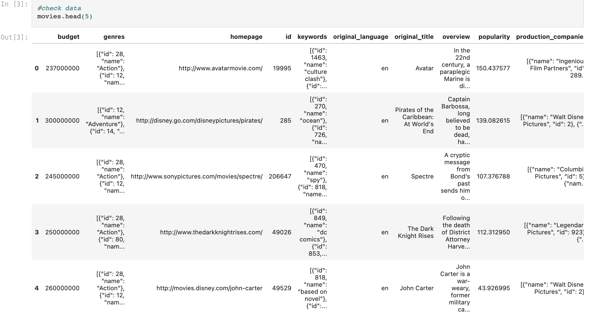
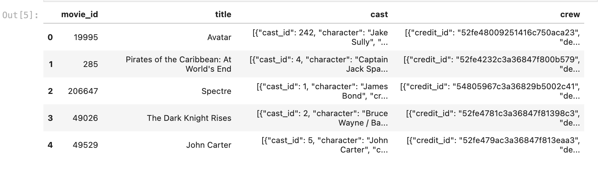
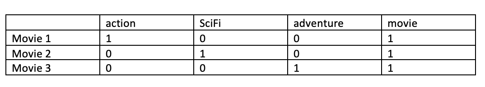

# Movie Recommendation - Group Project

A content-based recommender system that recommends movies similar to the movie the user enter

## Introduction

When we click on a movie on Netflix to watch then it recommend us so many movies relate to the movie that we click on. We wondered ourself that how they can do that and what are the keys. These factors motivate our group to do this project for the Data Science Fundamental class.

The objective of this project is to practice using Jupiter Notebook. The movies recommendation are based on the content of the movie you entered or selected. The main parameters that are considered for the recommendations are the movie_id, the titles, and the tags. The tags of the movies include genres, keywords, overview, cast, crew. The details of the movies are fetched from [TMDB](https://developers.themoviedb.org/3/getting-started/introduction).[1]

## Selection of Data

The model processing and training are conducted using Jupiter Notebook.

There are two datasets:

- tmdb_5000_movies.csv. This dataset includes 20 features such as 'budget', 'genres', 'homepage','id','keywords',...

- tmdb_5000_credits.csv. This dataset includes 4 features such as 'movie_id', 'title', 'cast', 'crew'.

The dataset can be found at [kaggle](https://www.kaggle.com/datasets/tmdb/tmdb-movie-metadata?select=tmdb_5000_movies.csv)[2]

## Method

### Tools:

- NumPy, Pandas, nltk and scikit-learn for data cleaning and building model
- Matplotlib (pylot) for visualizing features
- ast (literal_eval) for evaluating a string that contains a Python list, and convert it to a list object
- Pickle (dump, load) for converting a Python object into a byte stream to store it in a file/database, maintain program state across sessions, or transport data over the network.
- [Streamlit](https://docs.streamlit.io/)[3] (st) for wep app design
- GitHub and Heroku for web app deployment and hosting/version control
- VS Code as IDE, jupyter notebook

### Inference methods used with nltk:

- Modules: stem.porter
- Classes: PorterStemmer

#### - PorterStemmer: Stemming and lemmatization

Removing the commoner morphological and inflexional endings from words in English.

##### **Ex:**

- action, actions, acting -> act
- aid, aided, aids -> aid

### Inference methods used with Scikit-learn:

- Modules: feature_extraction.text, metrics.pairwise
- Classes: CountVectorizer (stop word), cosine_similarity

#### - CountVectorizer:

- Word vectorization - words to vectors (list of number)
- Using Bag of Words ( simplifying representation for NLP), representing words by their frequencies

##### **Ex:**

- movie_1 : action movie (tags)
- movie_2 : SciFi movie (tags)
- movie_3 : adventure movie (tags)

#### - Cosine similarity:

Cosine similarity is a metric used to measure how similar the documents are irrespective of their size. Mathematically, it measures the cosine of the angle between two vectors projected in a multi-dimensional space. The cosine similarity is advantageous because even if the two similar documents are far apart by the Euclidean distance (due to the size of the document), chances are they may still be oriented closer together. The smaller the angle, higher the cosine similarity.

**Distance = 1/similarity**

**Cosine similarity = 1 – cosine distance**

##### **Ex:**

- if angle = 5 => two movies are considered almost the same
- if angle = 90 => two movies are considered to be haft the same
- if angle = 180 => two movies are considered differently with each other’s

**More about Cosine Similarity:**

[Understanding the Math behind Cosine Similarity](https://www.machinelearningplus.com/nlp/cosine-similarity/)[4]

#### - Similarity Score:

**How does it decide which movie is most similar to the movie user enter(or selects)?** Here comes the similarity scores.

It is a numerical value ranges between zero to one which helps to determine how much two items are similar to each other on a scale of zero to one. This similarity score is obtained measuring the similarity between the text details of both of the items. So, similarity score is the measure of similarity between given text details of two items. This can be done by cosine-similarity.

## Results

Check out the live demo: https://movies-recommender-vod6.herokuapp.com/

### Architecture

### How to get the API key?

Create an account in [the movie database](https://www.themoviedb.org/.)[5] Once you successfully created an account, click on the `API` link from the left hand sidebar in your account settings and fill all the details to apply for an API key. If you are asked for the website URL, just give "NA" if you don't have one. You will see the API key in your `API` sidebar once your request has been approved.

### How to run the project?

1. Clone or download this repository to your local machine.
2. Install all the libraries mentioned in the `requirements.txt` file with the command `pip install -r requirements.txt`
3. Get your API key from https://www.themoviedb.org/. (Refer the above section on how to get the API key)
4. Replace YOUR_API_KEY in `TMDB_API_KEY`
5. Open your terminal/command prompt from your project directory and run the file `app.py` by executing the command `streamlit run app.py`.
6. Hurray! That's it.

## Discussion
- The movie recommendation helps us suggest which movie has related to which movie we currently watch. It helps us waste less time browsing the next one. Also, it matters to the user because some movies don't show us a good impression on the poster. So we may miss the chance to explore new genres of cinema. Example: "Inception" is epic sci-fi. But the movie recommendation is "The Animal" which is also sci-fi, but the poster doesn't give us the high expression about that a good movie.
- 
- Another researcher do searching engine using a matrix factorizations algorithm. We used the cosine similarity algorithm to detect the closer
neighbors with the input data from the search. Another researcher implemented the database with the plain Python script to return the 
movie recommendation to the database and render the result throughout the front-end site.

- Future Research for movie recommendation is giving the user the rating and review for which movie they watched and leave the commend so that is another piece of information that we could able to apply hugging face model for anylyze the commend. Based on that, we could able to improve our movie recommendation more accuracy.

## Summary
- How we turn the mathematics cosine similarity to our data and filter out the result like the way we represent and visualation it on the web-page

- Second is how we dualing with the large dataset and run time complexity is one of the issue we may occur when we have been working on this project 
## Reference

[1] [TMDB](https://developers.themoviedb.org/3/getting-started/introduction)

[2] [movie dataset](https://www.kaggle.com/datasets/tmdb/tmdb-movie-metadata?select=tmdb_5000_movies.csv)

[3] [Streamlit](https://docs.streamlit.io/)

[4] [Math behind Cosine Similarity](https://www.machinelearningplus.com/nlp/cosine-similarity/)

[5] [the movie database](https://www.themoviedb.org/.)

[6] [Rate-5-Get-5-Movie-Recommendation-System] (https://github.com/lecritch/Rate-5-Get-5-Movie-Recommendation-System)
